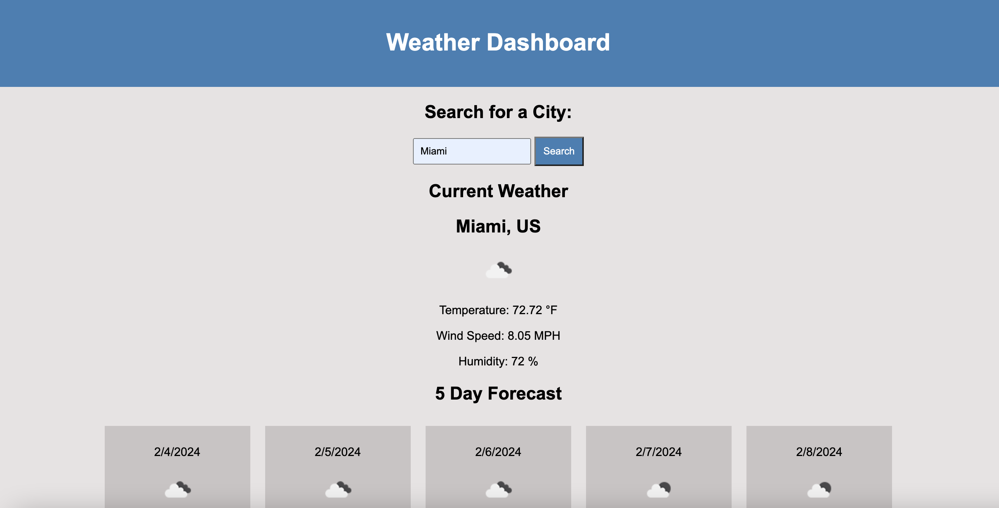
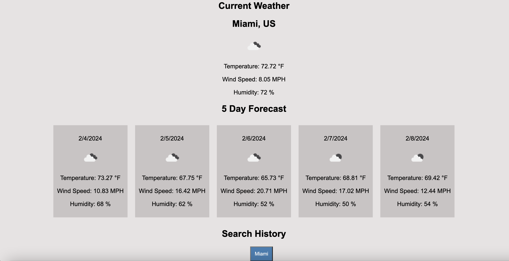

# weather-dashboard
A weather dashboard that runs in the browser and features dynamically updated HTML and CSS using a server-side API.

## Description

This is a webpage that was created using Javascript and server-side APIs to create a a weather dashboard. It retrieves data from openweathermap.org in order to display the information for the current weather for cities that the user searches.

## Installation

N/A

## Usage

To use this webpage, the user can type in the name of a city in the United States, and click the search button. The results of the current weather and a 5-day forecast will display. It will have the location, temperature, wind speed, humidity percentage, and an icon of the weather. When the user types in a city name, that city will be saved in the search history as a clickable button that will retrieve the weather information again.

## Assets

The following images demonstrate the web application's appearance:

 

Here is the link to the deployed application:

## Credits

Acknowledgments: Worked on project with Marisol Aranda, Danniel Merino, Amanda Vilwock, and Ismael Madera. I also used Xpert Learning Assistant, documentation from openweathermap.org, module 6 activites and mini project, and developer.mozilla.org (MDN Docs) as resources to create code. Also used information from following website link: 
https://stackoverflow.com/questions/44177417/how-to-display-openweathermap-weather-icon
https://stackoverflow.com/questions/74176515/weather-information-not-displaying-after-making-api-call-to-openweathermap-org

## License

MIT License (Please refer to license in repo)
